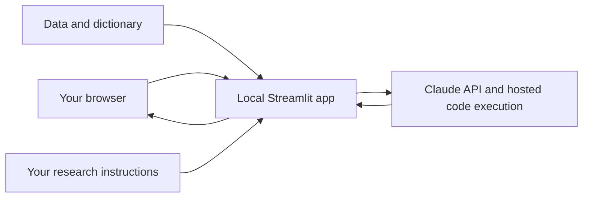

# TMAG example for creating one's own research assistant LLM

Build a research assistant that answers questions about your own survey data,
calculates results, and explains the evidence behind its answers.

This beginner tutorial grows out of Central Moment's **2018 SFO Customer Survey**
project. You will first run a small fictional example, then reproduce the SFO
setup, then adapt the assistant to your own research. You do not need to train a
model or understand machine learning to begin. Basic file editing is enough for
the first walkthrough; adapting the statistics requires subject-matter judgment.

**Start here: [the step-by-step beginner guide](docs/01-beginner-guide.md).**

## What you are building

A local browser chat interface made with Python and Streamlit. It sends your
question, instructions, and selected files to the Claude API. Claude can run
Python in Anthropic's hosted code-execution environment to calculate answers.
The browser interface is local; the analysis and uploaded files go to Anthropic.

This is a custom application around an existing LLM, not a newly trained LLM.
The included approach suits structured research data. A large library of papers
may need document retrieval, page citations, and a different evaluation design.

## Read in order

1. [Install, configure, and run the practice example](docs/01-beginner-guide.md)
2. [Repeat the SFO project steps](docs/02-reproduce-sfo.md)
3. [Create your own assistant](docs/03-customize-your-assistant.md)
4. [Check answers and troubleshoot](docs/04-evaluation-and-troubleshooting.md)
5. [Understand the project choices and next steps](docs/05-project-history-and-next-steps.md)

## Files you will edit

| File | Purpose |
|---|---|
| `.env` (create locally) | Your secret API key and model selection |
| `config.json` | App title, instructions file, and files to upload |
| `prompts/practice.md` | Instructions for the fictional practice assistant |
| `prompts/sfo.md` | Adapted instructions from the original SFO app |
| `config.sfo.json` | Ready-made SFO configuration |
| `data/private/` | Your local data; excluded from Git |
| `streamlit_app.py` | The chat interface and API calls |
| `scripts/check_setup.py` | Local checks without an API call |

Python 3.11 or 3.12 is the intended starting environment. Dependencies are pinned
to versions present in the source project's environment. Paid API access is
required for chat; local checks are free. A consumer chat subscription does not
configure this application's API credentials or budget.

## Status and boundaries

Initial teaching repository, derived from the current single-process SFO app.
The example data are synthetic. Original research data, keys, chat logs, old
evaluation outputs, and the retired R environment are not distributed here.
See [validation notes](docs/VALIDATION.md) for what was actually checked.

Prompt instructions guide the model; they are not programmatic guarantees of
correct statistics, privacy, or compliance. Review results before using them.
This starter has no login system, access controls, persistent conversations, or
automatic download interface for model-generated charts/files. Run locally.

No open-source license has been selected yet. Repository visibility does not by
itself grant redistribution rights. Data obtained elsewhere retain their own terms.
