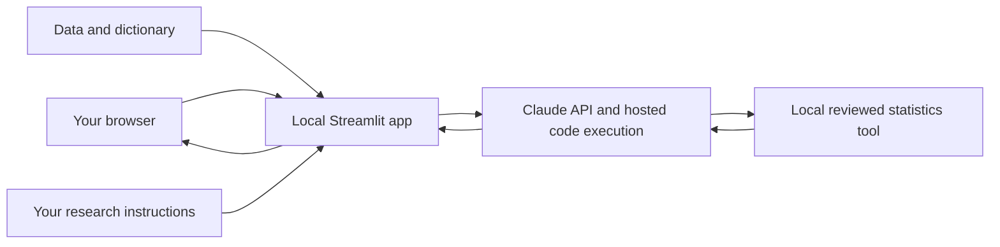

# TMAG example for creating one's own research assistant LLM

Build a research assistant that answers questions about your own survey data,
calculates results, and explains the evidence behind its answers.

This beginner tutorial grows out of Central Moment's **2018 SFO Customer Survey**
project. You will first run a small fictional example, then reproduce the SFO
setup, then adapt the assistant to your own research. You do not need to train a
model or understand machine learning to begin. Basic file editing is enough for
the first walkthrough; adapting the statistics requires subject-matter judgment.

**Start here: [how I began—with ChatGPT, a grilling skill, and voice](docs/00-start-with-a-conversation.md).**

**Only have a few minutes? Read the [annotated SFO example](docs/10-worked-example.md)**
and [validation report](docs/VALIDATION.md). They show the data checks, independent
calculations, observed model behavior, and remaining limitations without installation.

The project began with a conversation in the ChatGPT app: use `grill-with-docs`,
turn on ChatGPT Voice, and ask it to interview you **one question at a time**.
That experience can feel almost surreal: you talk through a rough idea while the
assistant challenges assumptions and helps turn your answers into a clear plan.
The opening chapter includes skill setup for ChatGPT Work and Claude Cowork,
a downloadable skill, and the exact kind of prompt attendees can try themselves.

Ready to build? Continue to [the step-by-step app setup](docs/01-beginner-guide.md).

## What you are building

A local browser chat interface made with Python and Streamlit. It sends your
question, instructions, and selected files to the Claude API. Claude can run
Python in Anthropic's hosted code-execution environment to calculate answers.
The browser interface is local; the analysis and uploaded files go to Anthropic.
Reviewed descriptive statistics also run through a fixed local calculator, shared
by the application and the evaluation runner. Answers and tool traces can be
downloaded as evidence, and generated charts/files are retrieved into the interface.

This is a custom application around an existing LLM, not a newly trained LLM.
The included approach suits structured research data. A large library of papers
may need document retrieval, page citations, and a different evaluation design.

## Read in order

0. [Begin with the voice interview and install grill-with-docs](docs/00-start-with-a-conversation.md)
1. [Install, configure, and run the practice example](docs/01-beginner-guide.md)
2. [Repeat the SFO project steps](docs/02-reproduce-sfo.md)
3. [Create your own assistant](docs/03-customize-your-assistant.md)
4. [Check answers and troubleshoot](docs/04-evaluation-and-troubleshooting.md)
5. [Understand the project choices and next steps](docs/05-project-history-and-next-steps.md)
6. [Run the full test-question battery and grade the results](docs/06-running-the-question-battery.md)
7. [Inspect the completed research brief and design decisions](docs/07-research-brief-and-decisions.md)
8. [Understand statistical policy and enforcement boundaries](docs/08-statistical-policy.md)
9. [Operate, share, and maintain the assistant](docs/09-operating-and-maintaining.md)
10. [Follow an annotated SFO question from data to verified answer](docs/10-worked-example.md)

## Test it with the original research questions

The [full SFO question battery](evaluation/sfo-question-battery.md) includes all
34 original questions across 10 categories, plus four wording variants from the
historical automated runner. It covers factual calculations, judgment, ambiguous
concepts, comparisons, causality, out-of-scope requests, exploration, methodology,
segmentation, and chart/file delivery.

Use the [evaluation walkthrough](docs/06-running-the-question-battery.md) to run
one question at a time, verify calculations independently, and grade the answers.
Copy the [blank scorecard](evaluation/scorecard-template.md) for each run. The
battery is also available as [JSON](evaluation/sfo-question-battery.json), with
stable IDs and the complete historical 29-question mapping. These materials are
test inputs and review criteria; they do not claim the current app has passed.

## Files you will edit

| File | Purpose |
|---|---|
| `.env` (create locally) | Your secret API key and model selection |
| `config.json` | App title, instructions file, and files to upload |
| `prompts/practice.md` | Instructions for the fictional practice assistant |
| `prompts/sfo.md` | Adapted instructions from the original SFO app |
| `config.sfo.json` | Ready-made SFO configuration |
| `data/private/` | Your local data; excluded from Git |
| `streamlit_app.py` | The chat interface and API calls |
| `research_assistant/` | Shared data audit, fixed calculator, API loop and evidence export |
| `profiles/sfo.json` | Reviewed codes, statistics and dictionary locations |
| `prompts/research-policy.md` | Shared statistical and artifact instructions |
| `scripts/fetch_sfo.py` | Download source files without overwriting existing copies |
| `scripts/build_reference.py` | Independently compute numerical SFO references |
| `scripts/run_battery.py` | Run live questions, preserve evidence and clean up remote files |
| `scripts/check_setup.py` | Local checks without an API call |
| `evaluation/scorecard-template.md` | Copy into `output/evaluation/` to record a run |

Python 3.11 or 3.12 is the intended starting environment. Dependencies are pinned
to versions present in the source project's environment. Paid API access is
required for chat; local checks are free. A consumer chat subscription does not
configure this application's API credentials or budget.

## Status and boundaries

Initial teaching repository, derived from the current single-process SFO app.
The example data are synthetic. Original research data, keys, chat logs, old
evaluation outputs, and the retired R environment are not distributed here.
See [validation notes](docs/VALIDATION.md) for what was actually checked.

Prompt instructions guide the model; they are not programmatic guarantees of
correct statistics, privacy, or compliance. Review results before using them.
This starter has no login system, access controls, or server-side persistent
conversations. It supports downloadable evidence, generated files, and explicit
remote-file cleanup. Run locally; see the operating guide before considering hosting.

Code and original documentation use [Apache License 2.0](LICENSE).
Data obtained elsewhere retain their own terms; see [NOTICE](NOTICE).
