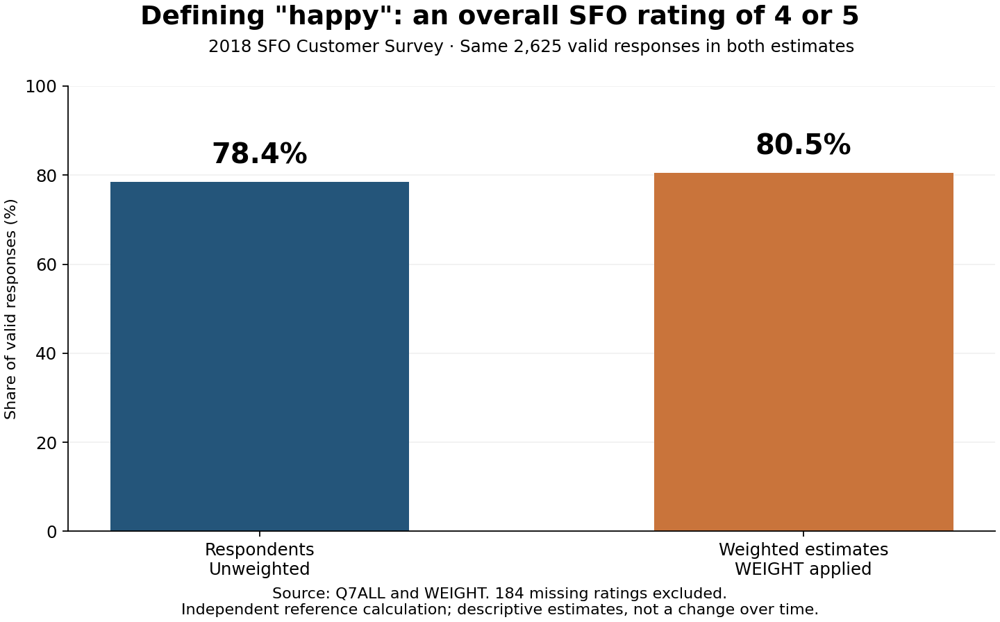

# One question, from source data to a checked answer

This is the shortest route through the example without installing anything.
The calculations below were independently reproduced from the original SFO files.
The accompanying model outputs are observed trials, not idealized transcripts.

## 1. Start with the research question

> What percentage of respondents are happy with SFO? Define happy as Q7ALL 4 or 5
> and report the valid denominator.

"Happy" is our operational definition. The survey measured an overall-airport
rating, not a separate emotion. "Respondents" calls for an unweighted description.
We choose valid answers as the denominator before asking the model.

For a reusable assistant with a global satisfaction definition, take this one step
further: calculate a `satisfied` column ahead of time and add it to the prepared
data and dictionary. Then instruct the assistant to use that column consistently.
Otherwise, "satisfaction" is left to the selected LLM's interpretation and may
change between questions. This walkthrough explicitly supplies a definition in
the question; the original SFO files do not contain that derived column. Follow
the [predefined-variable instructions](03-customize-your-assistant.md#define-recurring-measures-before-loading-the-data)
to preserve a definition across queries and fresh conversations.

## 2. Inspect the evidence

The verified CSV has 2,809 rows and 97 columns. RESPNUM is unique. Both source
downloads match the original workspace files byte-for-byte. The
[download manifest](../evaluation/reference/source-manifest.json) and
[data audit](../evaluation/reference/data-audit.json) record the evidence.

In the dictionary's **Code List!A234:C255**, Q7ALL means SFO airport as a whole.
Valid codes are 1–5, with 1=Unacceptable and 5=Outstanding. Codes 2, 3 and 4 have
no verbal labels. Code 6 is not applicable and 0 is blank. In this CSV, the missing
overall ratings appear as the literal string `BLANK`.

The reviewed profile preserves these decisions. A pre-upload audit rejects
unexpected codes, duplicate IDs and invalid weights. It warns that Q15A is not
explicitly named in this dictionary. An audit finding is documented rather than
silently "fixed" by changing original data.

## 3. Compute the independent reference

The [reference script](../scripts/build_reference.py) uses Python's CSV reader
and `math.fsum`. It does not import the app's calculator. Its
[reference output](../evaluation/reference/sfo-reference.json) stays outside the
assistant's uploads so the model must calculate rather than repeat an answer key.

| Step | Result |
|---|---:|
| Original respondent rows | 2,809 |
| Excluded missing overall ratings | 184 |
| Valid Q7ALL answers | 2,625 |
| Q7ALL=4 | 1,428 |
| Q7ALL=5 | 631 |
| Numerator, Q7ALL in {4,5} | 2,059 |
| Unweighted percentage, 100 × 2,059 / 2,625 | 78.4381% |

This small independent check is enough to catch an incorrect denominator, a missing
code treated as a rating, or an accidental top-box-only definition.

## 4. Trace the assistant's calculation

The model can call the reviewed `survey_statistic` tool with this structured input:

```json
{
  "field": "Q7ALL",
  "statistic": "percentage",
  "success_codes": [4, 5],
  "weighted": false
}
```

The tool validates the requested field and operation, selects valid codes, checks
the denominator, applies reporting thresholds and returns a result with n and
exclusions. It executes fixed Python code rather than arbitrary model-written
expressions. See [the implementation](../research_assistant/statistics.py).

The answer should say approximately **78.4%, or 2,059 of 2,625 valid responses**,
with the definition, unweighted mode and 184 exclusions. The evidence bundle
contains the actual tool arguments/results, model response, timing and input hashes.
The correct tool result does not guarantee that every sentence the model adds is correct.

## 5. Change the weighting in a follow-up

> Now recompute that percentage using WEIGHT, keep the same valid-answer denominator,
> and create a PNG chart comparing the unweighted and weighted percentages plus a
> CSV of its aggregate data.

The independent weighted calculation is:

```text
100 × sum(WEIGHT for valid Q7ALL in {4,5}) / sum(WEIGHT for all valid Q7ALL)
= 80.4852%
```

The valid unweighted n remains **2,625**. The valid sum of weights is **2,618.6699184**.
Those are different quantities. This also resolves the old report's 2,625 versus
approximately 2,619 discrepancy: the latter is a rounded weight sum, not the raw
number of included respondent records.

The numerical difference is **2.0471 percentage points**. It reflects reweighting
the same observations; it is not change over time or evidence of statistical significance.



This figure is rendered by [the reference-chart script](../scripts/render_reference_chart.py)
from the independent answer key. It is separate from the model's unedited files.

The [published walkthrough evidence](../evaluation/published/walkthrough/README.md)
includes observed answers, sanitized calculation records, a PNG and an aggregate CSV.
The artifact files are retrieved through the API, not reconstructed from a claim
that a chart exists. Compare their values, labels and denominators with the reference.

## 6. Keep the failure and explain the repair

The first live walkthrough got the headline numbers right but described a small
cell as "suppressed (n<50)." The actual suppression rule is n<20; n<50 is a caution
threshold. A separate weighted-distribution answer invented "Average" and "Good"
labels for the unlabeled Q7 codes.

These are **partial results**, not fully correct answers. The repair made the tool's
suppression and caution rules explicit in separate output fields and strengthened
the prompt to preserve dictionary labels. Numerical regression trials and the
follow-up example were then rerun. The validation report keeps baseline findings
separate from revised trials so the original mistakes remain visible.
The [completed scorecard](../evaluation/published/scorecard.md) also shows failures
in broader synthesis and exported files. A working interface and correct headline
arithmetic are necessary ingredients, but do not complete research validation.

## 7. Reproduce and adapt

From a configured checkout:

```powershell
& '.\.venv\Scripts\python.exe' scripts/check_setup.py --config config.sfo.json
& '.\.venv\Scripts\python.exe' scripts/build_reference.py
& '.\.venv\Scripts\python.exe' scripts/run_battery.py --question 'What percentage of respondents are happy with SFO? Define happy as Q7ALL 4 or 5 and report the valid denominator.' --follow-up 'Now recompute that percentage using WEIGHT, keep the same valid-answer denominator, and create a PNG chart comparing the unweighted and weighted percentages plus a CSV of its aggregate data.'
```

The CLI creates evidence under `output/evaluation/` and attempts remote-file deletion
after the trial. In the browser, use **Download conversation evidence** and explicitly
delete the session's remote files before closing it. For your own data, replace the
research definition, field profile, independent reference and tests together.

The browser was also checked with the fictional dataset. This narrow-viewport
screenshot shows actual chart/download controls and the stale-input warning after
a configuration edit. The app blocks further questions until a new conversation
is started, preventing old uploads from silently serving changed inputs.


